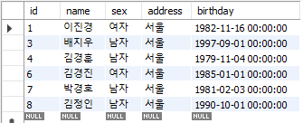
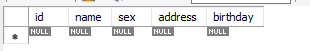

#### DELETE

: 행단위로 데이터를 삭제한다.


* 문법

```mysql
DELETE FROM 테이블명 [WHERE 삭제하려는 칼럼 명=값]
```


* 예제

```mysql
DELETE FROM student WHERE id = 2;
```





---


#### TRUNCATE

: 테이블의 전체 데이터를 삭제

: 테이블에 외부키가 없다면 DELETE 보다 훨씬 빠르게 삭제된다.


* 예시

```mysql
TRUNCATE student;
```



---


#### DROP TABLE

: 테이블을 삭제한다.


* 예시

```mysql
DROP TABLE student;
show tables;
```

