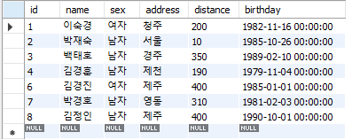
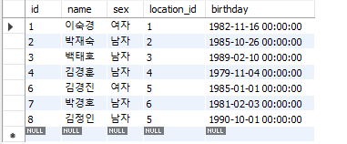
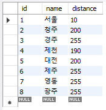
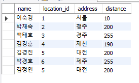
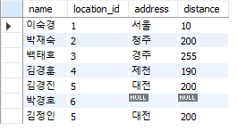
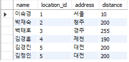

#### JOIN

: 데이터의 규모가 커지면서 하나의 테이블로 정보를 수용하기가 어려워지면 테이블을 분할하고 테이블 간의 관계성을 부여한다.


* 예제

```mysql
DROP TABLE IF EXISTS `student`;
CREATE TABLE `student` (
  `id` tinyint(4) NOT NULL,
  `name` char(4) NOT NULL,
  `sex` enum('남자','여자') NOT NULL,
  `address` varchar(50) NOT NULL,
  `distance` INT NOT NULL,
  `birthday` datetime NOT NULL,
  PRIMARY KEY (`id`)
) ENGINE=InnoDB DEFAULT CHARSET=utf8;
   
INSERT INTO `student` VALUES (2, '박재숙', '남자', '서울',  10, '1985-10-26 00:00:00');
INSERT INTO `student` VALUES (1, '이숙경', '여자', '청주', 200, '1982-11-16 00:00:00');
INSERT INTO `student` VALUES (3, '백태호', '남자', '경주', 350, '1989-2-10 00:00:00');
INSERT INTO `student` VALUES (4, '김경훈', '남자', '제천', 190, '1979-11-4 00:00:00');
INSERT INTO `student` VALUES (8, '김정인', '남자', '제주', 400, '1990-10-1 00:00:00');
INSERT INTO `student` VALUES (6, '김경진', '여자', '제주', 400, '1985-1-1 00:00:00');
INSERT INTO `student` VALUES (7, '박경호', '남자', '영동', 310, '1981-2-3 00:00:00');
```




위의 예제에서 address 는 distance 와 관련되어 있기 때문에 location 이라는 별도의 테이블로 분할


```mysql
DROP TABLE IF EXISTS `student`;
CREATE TABLE `student` (
  `id` tinyint(4) NOT NULL,
  `name` char(4) NOT NULL,
  `sex` enum('남자','여자') NOT NULL,
  `location_id` tinyint(4) NOT NULL,
  `birthday` datetime NOT NULL,
  PRIMARY KEY (`id`)
) ENGINE=InnoDB DEFAULT CHARSET=utf8;
```

값을 추가로 넣어준다.



```mysql
DROP TABLE IF EXISTS `location`;
CREATE TABLE `location` (
`id`  tinyint UNSIGNED NOT NULL AUTO_INCREMENT ,
`name`  varchar(20) NOT NULL ,
`distance`  tinyint UNSIGNED NOT NULL ,
PRIMARY KEY (`id`)
) ENGINE=InnoDB DEFAULT CHARSET=utf8;;
```




#### JOIN

: 테이블간의 관계성에 따라서 복수의 테이블을 결합, 하나의 테이블인 것처럼 결과 출력


#### JOIN의 종류

* OUTTER JOIN : 매칭되는 행이 없어도 결과를 가져오고 매칭되는 행이 없는 경우 NULL로 표시 
  LEFT JOIN과 RIGHT JOIN이 있다.

* INNER JOIN : 조인하는 두개의 테이블 모두에 데이터가 존재하는 행에 대해서만 결과를 가져온다.


#### LEFT JOIN

```mysql
SELECT s.name, s.location_id, l.name AS address, l.distance  FROM student AS s LEFT JOIN location AS l ON s.location_id = l.id;
```




#### OUTTER JOIN과 INNER JOIN의 차이

```mysql
DELETE FROM location WHERE name='제주'; 
 
SELECT s.name, s.location_id, l.name AS address, l.distance  FROM student AS s LEFT JOIN location AS l ON s.location_id = l.id; 
 
SELECT s.name, s.location_id, l.name AS address, l.distance  FROM student AS s INNER JOIN location AS l ON s.location_id = l.id;
```

OUTTER JOIN



INNER JOIN

