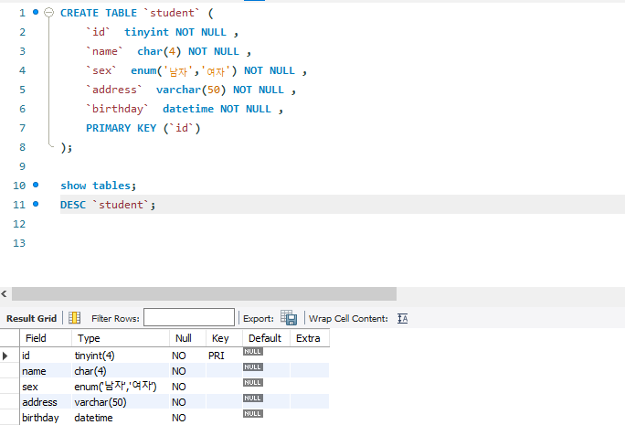

#### 1. 데이터 베이스 생성

* class 이름의 데이터 베이스 생성

```mysql
CREATE DATABASE `class` CHARACTER SET utf8 COLLATE utf8_general_ci; 

```

* 삭제

```mysql
DROP DATABASE `데이터베이스명`;
```

* 열람

```mysql
SHOW DATABASES;
```


---


#### 2. Table

 : 데이터가 실질적으로 저장되는 저장소 

##### Schema란 ? : 테이블에 적재될 데이터의 구조와 형식을 정의하는 것

* 테이블 생성

```mysql
CREATE TABLE table_name (
    칼럼명1 data_type,
    칼럼명2 data_type
)
```

* 테이블 스키마 열람

```mysql
DESC `테이블명`
```





---


#### 

프로그래머스 SQL 문제풀기

