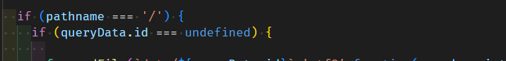
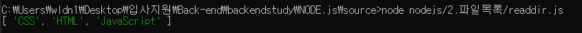
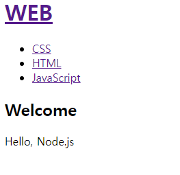
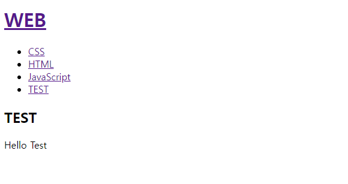

### 홈페이지 구현

강의링크 : https://youtu.be/krfmrBsWqzs

조건문을 통해 url 별로 홈페이지 구현





---

### 파일목록 알아내기

강의링크 : https://youtu.be/tzJ2K3Yp89I

##### 하고자 하는것 : data를 수정할때 , 파일의 여러부분을 수정해야한다.

##### 해결하고자 하는 방법 : data directory가 수정됬을때 nodejs를 통해 알아낼 수 있는가 

#####                                           -> fs.readdir




사용코드

```javascript
var testFolder = './data';
var fs = require('fs');

fs.readdir(testFolder, function(error,fileList){
  console.log(fileList);
});
```

---

### 글 목록 출력하기

강의링크 : https://youtu.be/ibz2gaW-tyQ

위에서의 fs.readdir 활용

```javascript
 fs.readdir('./data',function(error,filelist){
        console.log(filelist);
        var title = 'Welcome';
      var description = 'Hello, Node.js'
      var list = '<ul>';
      var i = 0;
      while(i < filelist.length){
        list = list + `<li><a href="/?id=${filelist[i]}">${filelist[i]}</a></li>`
        i = i + 1;
      }
      list = list + '</ul>';
```

* filelist에서 list가 있는 만큼만 ul 태그를 생성하고 보여주도록 코드를 바꾸었다. ${list}


##### 결과 : data directory에 새로운 파일을 생성하고 새로고침하면 새로운 링크가 추가된다.


초기상태



data directory 에 TEST 라는 파일과 'Hello Test' 라는 내용을 수정

